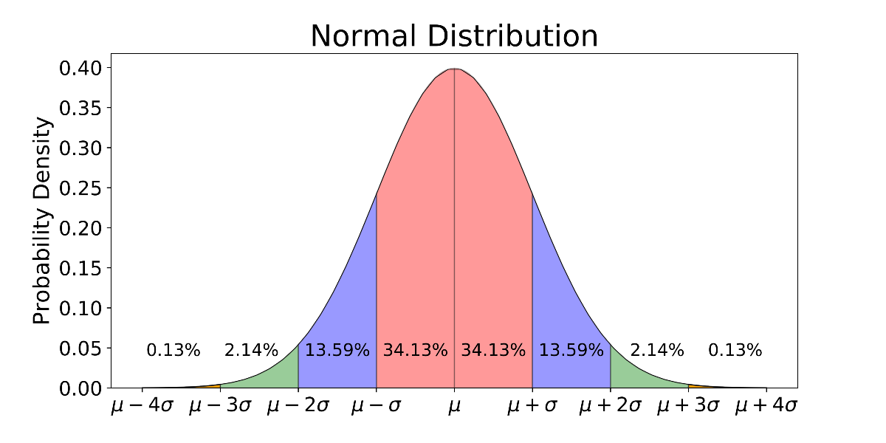
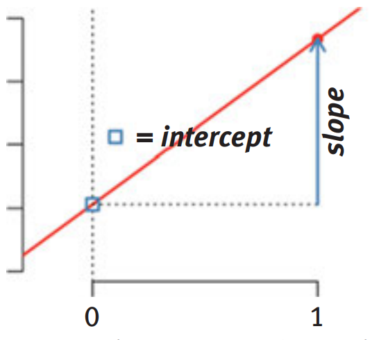

class: center
background-image: url("mainFinal2.png")

---

<style type="text/css">
body, td {
   font-size: 15px;
}
code.r{
  font-size: 15px;
}
pre {
  font-size: 20px
}
.huge .remark-code { /*Change made here*/
  font-size: 200% !important;
}
.tiny .remark-code { /*Change made here*/
  font-size: 80% !important;
}
</style>

## Press record

```{r metathis, echo=FALSE, message=FALSE, warning=FALSE}
library(metathis)
meta() %>%
  meta_name("github-repo" = "nvaci/Lecture_1") %>% 
  meta_social(
    title = "Lecture 1: Linear regression",
    description = paste(
      "First lecture for the Advanced Statistics course at Psychological Research Methods in Psychology master course",
      "Sheffield 2023."
    ),
    url = "https://nvaci.github.io/Lecture_1/Index.html#1",
    image= "https://nvaci.github.io/Lecture_1/Index.html#1",
    og_type = "website",
    og_author = "Nemanja Vaci",
    twitter_card_type = "summary_large_image",
    twitter_site = "@nemanja_vaci"
  )
```

---
## Logistics

- What are we planning to talk about : https://nemanjavaci.netlify.app/advanced-stats-course/course-handbook_2023/<br/> <br/>
  a) Generalized linear models <br/>
  b) Structural equation modelling: path models and confirmatory factor analysis <br/>
  c) Mixed-effects models: cross-sectional and longitudinal data <br/> <br/>
- Theory and practice (70 minutes + 30 minutes):<br/><br/>
a) Theoretical aspect – why and when would we want to use a certain statistical model <br/>
b) Mathematical aspect – the mathematical basis of the model and how can we transform the data and parameters <br/>
c) Practical aspect – using R to analyse the data and build the statistical models on real-world data <br/>
<br/>
We will start each lecture with the analysis of the data using models from previous lecture: this is going to be led by you! <br/>
<br/>
- R statistical environment
<br/>
- Materials:<br/>
a) Presentations (press __p__ for additional content)<br/>
b) Commented R code
([link](https://nemanjavaci.netlify.app/advanced-stats-course/psy6210-r-code/) for this lecture)<br/>
c) Course glossary: [link](https://nemanjavaci.netlify.app/advanced-stats-course/psy6210-glossary/)
???
General overview of the course<br/>
<br/>
Focus on theory and applications, but also on how to use these models in the R environment<br/>
<br/>
Each lecture is planned to be supported by HTML presentation with main slide content and lecturer's notes + commented code that produced outputs in the presentation. Often, I will include additional content that you can explore, but it is not going to be used for any subsequent knowledge assessments. 
<br/>
I will provide you the data and research question, and your job will be to analyse the data and prepare a short discussion for the next meeting. 
---
## Knowledge assessment

####The application of statistical methods to the existing data
A series of research questions for which you will have to propose a statistical model that tests hypothetical assumptions, motivate your models, build them in the R statistical environment, and interpret results (parameters, fit and critique of the model)

Homework: 10% of the final mark <br/>
Final essay type exam: 90% of the final mark


The exam will focus on the: <br/>
a) Theoretical aspect <br/>
b) Mathematical aspect <br/>
c) Practical aspect 
<br/>
---
## Opportunities for feedback:

Discussions during the classes <br/>
Feedback on the homework <br/>
Feedback form <br/>

Course communication: n.vaci@sheffield.ac.uk <br/>
Office hours: Friday from 1 to 2 pm (https://tinyurl.com/y2ptqmwx)<br/>
Post your questions on the spreadsheet queries

---

## Today: linear regression

Intended learning outcomes: <br/>

Explain and motivate the linear regression model and how it relates to other statistical methods <br/> 

Build a model; analyse and interpret the coefficients (model with one predictor, categorical predictors, multiple predictors, and interactions) <br/>

Interpret other information that linear regression reports: determination coefficient, F-test, residuals <br/>

Evaluate fit and assumptions of the linear regression model <br/>

---
class: center, inverse
background-image: url("main.gif")
---
## Why do we use statistical models?

<br/>
--
Can you tell me some of the probability distributions do you know: [link](http://www.math.wm.edu/~leemis/chart/UDR/UDR.html)
---

## Gaussian (normal) distribution

$$y_ \sim \mathcal{N}(\mu,\sigma)$$

```{r, fig.align='center', echo=FALSE, out.width='90%'}

```


???
Gaussian distribution is described with two parameters: mean (measure of central tendency) and dispersion around the mean (standard deviation). 

Central limit theorem: [link](https://en.wikipedia.org/wiki/Central_limit_theorem)<br/><br/>

What can we do with one distribution: [Moments](https://en.wikipedia.org/wiki/Moment_(mathematics), [Normality](https://en.wikipedia.org/wiki/Normality_test#:~:text=In%20statistics%2C%20normality%20tests%20are,set%20to%20be%20normally%20distributed.)<br/>
What can we do with two? With three or more? <br/>
---

## Linear regression

Method that summarises how the average values of numerical outcome variable vary over values defined by linear functions of predictors ([visualisation](https://seeing-theory.brown.edu/regression-analysis/index.html#section1)) <br/> <br/>

--

$$ y = \alpha + \beta * x + \epsilon $$ 
--
```{r, fig.width=8, fig.height=5,fig.align='center', echo=FALSE}
par(bty='n',mar = c(5, 4, .1, .1), cex=1.1, pch=16)
data("cars")
plot(cars$speed, cars$dist, xlab='Predictor', ylab='Outcome')
abline(lm(dist~speed, data=cars), lwd=2)
```
???
The mathematical equation that estimates a dependent variable Y from a set of predictor variables or regressors X.<br/>

Each regressor gets a weight/coefficient that is used to estimate Y. This coefficient is estimated according to some criteria, eg. minimises the sum of squared errors or maximises the logarithm of the likelihood function. Additional reading: <br/> [Estimation of the parameters](https://data.princeton.edu/wws509/notes/c2s2) 
<br/><br/>

$\epsilon$ - measure of accuracy of the model<br/>
$SS_{residual}=\sum_{i=1}^{n}(Y_{i}-\hat{Y}_{i})^2=\sum_{i=1}^{n}e_{i}^2$<br/>
<br/>
Other options: https://en.wikipedia.org/wiki/Deming_regression
---

## Example

Predict the height (cm) of babies using age (months), weight (grams) and sex:

```{r,echo=FALSE}
set.seed(456)
Babies=data.frame(Age=round(runif(100,1,30)), Weight=rnorm(100,4000,500))
Babies$Height=rnorm(100,40+0.2*Babies$Age+0.004*Babies$Weight, 5)
Babies$Sex=factor(rbinom(100,1,0.5))
levels(Babies$Sex)=c('Girls','Boys')
```

```{r,echo=T, fig.width=14, fig.height=5, fig.align='center'}
par(mfrow=c(1,3), bty='n',mar = c(5, 4, .1, .1), cex=1.1, pch=16)
plot(Babies$Age, Babies$Height, xlab='Age (months)', ylab='Height (cm)')
plot(Babies$Weight, Babies$Height, xlab='Weight (grams)', ylab='Height (cm)')
boxplot(Babies$Height~Babies$Sex,xlab='Sex', ylab='Height (cm)')
```
???
Code for the simulation of the data:
```{r,echo=T}
set.seed(456)
Babies=data.frame(Age=round(runif(100,1,30)), Weight=rnorm(100,4000,500))
Babies$Height=rnorm(100,40+0.2*Babies$Age+0.004*Babies$Weight, 5)
Babies$Sex=factor(rbinom(100,1,0.5))
levels(Babies$Sex)=c('Girls','Boys')
```
---

## Interpretation: one predictor

$$ y = \alpha + \beta * Age + \epsilon $$ 

```{r}
lm1<-lm(Height~Age, data=Babies)
lm1$coefficients
```
--
Intercept is the average (predicted) score for children at birth (0 - months)<br/> <br/>

Counterfactual interpretation (causal): Increase of 1 unit in predictor value - Age (being one month older) changes the outcome by the $\beta$ (model estimated value) <br/> <br/>

Predictive interpretation (descriptive): If we compare babies that differ in their age by 1 month, we expect to see that older babies are taller by $\beta$ on average <br/> <br/>

???
Model summarises the difference in average Height between the children as a function of their Age. <br/> <br/>


Type of interpretation usually depends on the strength of the theoretical framework and methodological design. If you have well developed theoretical assumptions and experimental design, this perhaps allows you to use counterfactual interpretation.  

---

## Interpretation: multiple predictors

$$y = \alpha + \beta_1 * Age + \beta_2 * Weight + \epsilon$$ 
Interpretation becomes contingent on other variables in the model <br/> <br/>

```{r}
lm2<-lm(Height~Age+Weight, data=Babies)
lm2$coefficients
```

Age: Comparing babies that have same Weight, but differ in their Age by one month, the model predicts difference by a value of $\beta_1$ in their Height on average<br/> <br/>

Weight: Comparing babies that have same Age, but differ on their Weight by one gram, the model predicts difference by a value of $\beta_2$ in their Height on average

Regression coefficient is a [partial correlation](https://en.wikipedia.org/wiki/Partial_correlation) estimate 

???
```{r}
AgeRes=residuals(lm(Age~Weight, data=Babies))
HeightRes=residuals(lm(Height~Weight, data=Babies))
lm(HeightRes~AgeRes)$coefficients
```
---

## Interpretation: multiple predictors

$$y = \alpha + \beta_1 * Age + \beta_2 * Sex + \epsilon$$ 

Interpretation becomes contingent on other variables in the model <br/> <br/>

```{r}
lm2<-lm(Height~Age+Sex, data=Babies)
lm2$coefficients
```

Age: Comparing babies that have identical Sex, but differ in their Age by one month, the model predicts difference by a value of $\beta_1$ in their Height on average<br/> <br/>

Sex: Comparing babies that have same Age, but have different Sex, the model predicts difference by a value of $\beta_2$ in their Height on average <br/> <br/>

???
The model summarises difference in average Height between the children as a function of their Age and Sex. <br/> <br/>

Intercept is the average (prediction) score for girls (0 on Sex variable) and that have 0 months (birth).

---

## Categorical predictors

$$y = \alpha + \beta_1 * Age + \beta_2 * Sex_{Boys} + \epsilon$$ 

What is the model doing:
.center[

]


Each level is assigned a value: Girls - 0, Boys - 1 <br/> <br/>
The slope coefficient $\beta_2$ models the difference between the two levels

???
Additional reading on type of dummy coding in R: [link](https://stats.idre.ucla.edu/r/modules/coding-for-categorical-variables-in-regression-models/)
---

## Interpretation: interactions

$$y = \alpha + \beta_1 * Age + \beta_2 * Sex_{Boys} + \beta_3 * Age*Sex_{Boys} + \epsilon$$ 

We allow the slope of age to linearly change across the subgroups of Sex variable<br/> <br/>

```{r}
lm3<-lm(Height~Age*Sex, data=Babies)
lm3$coefficients
```

Age: In the case of girls, comparing difference in babies older by month, the model predicts average difference by $\beta_1$ coefficient<br/> <br/>

Sex: Expected difference between girls at birth and boys at birth is $\beta_2$ coefficient<br/> <br/>

Age*Sex: Difference in the Age slope for Girls and Boys
???
Intercept is the predicted Girls Hight at birth <br/> <br/>
Predicted Height for Boys, when Age is 0: Intercept + $Sex_{boys}$ <br/> <br/>
Slope for the Boys: Age + Age: $Sex_{Boys}$
---

## Interpretation: interactions

What about by-linear continous interactions?

$$y = \alpha + \beta_1 * Age + \beta_2 * Weight + \beta_3 * Age*Weight + \epsilon$$ 

```{r}
lm4<-lm(Height~Age*Weight, data=Babies)
lm4$coefficients
```

Age: Keeping weight at value of 0 and comparing babies that differ by 1 month in their age, the model predicts average difference of $\beta_1$ 

Weight: Keeping age at value of 0 (birth) and comparing babies that differ by 1 gram in their weight, the model predicts average difference of $\beta_2$

Age*Weight: The average difference between babies that differ by 1 month in their age, changes by $\beta_3$ with every 1 gram change in babies weight

???
By including an interaction we allow a model to be fit differently to subsets of data.<br/> <br/>
When to test the interactions: does the theory/clinical practice/previous studies postulate possibilities of interaction existing between your main effects? If yes, then proceed with caution. <br/> <br/>
+ a good sign is when the main effects are relatively strong and large and they explain a large amount of variation in the data

---

## Visualisation of the interaction

```{r, echo=F, fig.width=14, fig.height=5, fig.align='center', warning=FALSE, message=FALSE}
require(ggplot2)
simulatedD<-data.frame(Age=rep(seq(0, 30, by=1), 13), Weight=rep(seq(2872,4500, by=100), each=403))
simulatedD$Pred=predict(lm4, newdata = simulatedD)
p<-ggplot(simulatedD, aes(Age,Pred, color=Weight,frame=Weight))+geom_line()
plotly::ggplotly(p)
```

---

## What other information do we get from linear model?

```{r}
lm1<-lm(Height~Age, data=Babies)
summary(lm1)
```

???
Residuals - estimate of the error of the model <br/> <br/>
Coefficients with standard errors, as well as t-test and significance values. Test statistic (t-test) is used to test the significance of the predictor against 0. The reason why is it approximated with t distribution: [Link](https://stats.stackexchange.com/a/344008)<br/> <br/>
Residual standard error - estimate of the fit of our model: $\sqrt(\frac{SS_{residual}}{df})$
---

## Determination coefficient

$R^2 = 1 - \frac{SS_{residual}}{SS_{total}}$

```{r, echo=FALSE, warning=FALSE, message=FALSE}
require(ggplot2)
Babies$lm1=predict(lm1, newdata = Babies)
Babies$diff=Babies$lm1-Babies$Height
```

```{r,fig.width=12, fig.height=5, fig.align='center', warning=FALSE}
ggplot()+geom_linerange(data=Babies,aes(x=Age, ymin=Height,ymax=lm1,colour=diff), size=1.2)+geom_line(data=Babies,aes(x=Age, y=lm1), size=1.2)+geom_point(data=Babies, aes(Age, y=Height), size=2)+ylab('Height')+xlab('Age')+ggtitle('SS_residual')+theme(axis.title=element_text(size=14), axis.text =element_text(size=12))
```
???
Residual sum of squares: calculating vertical distances between observed data points and fitted regression line, raising them to the power of 2 (squaring) and summing them (addition). THe residual sum of squares informs us on the unexplained variance in our data - variance in the error term.  
---

## Determination coefficient

$R^2 = 1 - \frac{SS_{residual}}{SS_{total}}$

```{r}
lm0<-lm(Height~1, data=Babies)
summary(lm0)
```

```{r, echo=FALSE}
Babies$lm0=predict(lm0, newdata = Babies)
Babies$diff2=Babies$lm0-Babies$Height
```
???
We can fit only intercept model - only mean level of the dependent variable
---

## Determination coefficient

$R^2 = 1 - \frac{SS_{residual}}{SS_{total}}$

```{r,fig.width=10, fig.width=12, fig.height=5, fig.align='center', warning=FALSE}

ggplot()+geom_linerange(data=Babies,aes(x=Age, ymin=Height,ymax=lm0,colour=diff2), size=1.2)+geom_line(data=Babies,aes(x=Age, y=lm0), size=1.2)+geom_point(data=Babies, aes(Age, y=Height), size=2)+ylab('Height')+xlab('Age')+ggtitle('SS_total')+theme(axis.title=element_text(size=14), axis.text =element_text(size=12))
```

???
Total sum of squares: calculating vertical distances between observed data points and null model regression line (only intercept - mean of dependent variable), raising them to the power of 2 (squaring) and summing them (addition). The total sum of squares informs us on the total variance in our outcome/dependent variable. 
---

## Improvement in our prediction?

```{r, echo=FALSE}
Babies$diff3=Babies$lm1-Babies$lm0
```

$F = \frac{SS_m/df_m}{SS_r/df_r}$


```{r,fig.width=12, fig.height=5, fig.align='center', warning=FALSE}
ggplot()+geom_linerange(data=Babies,aes(x=Age, ymin=lm1,ymax=lm0,colour=diff3), size=1.2)+geom_line(data=Babies,aes(x=Age, y=lm0), size=1.2)+geom_line(data=Babies, aes(Age, y=lm1), size=1.3, linetype='dotdash')+geom_point(data=Babies, aes(x=Age, y=Height), size=0.9)+ylab('Height')+xlab('Age')+ggtitle('Improvement')+theme(axis.title=element_text(size=14), axis.text =element_text(size=12))
```
???
We can also calculate an F-test by hand. First we would need to calculate the amount of variance in the data that was explained by our model. We would get that by calculating distances between our fitted data points (fitted line) and null model line (mean level of dependent variable). We would square those distances and sum them up to get model/explained sum of squares.<br/><br/><br/>
To get an F-test, we would divide model sum of squares by the degrees of freedom spent on estimating the model (dfmodel - number of predictors). We would divide that by another unexplained amount of variance (residual sum of squares divided by residual degrees of freedom -> n - k +1 ).
---

## Why is this important? 

The general linear model is "basis" for all other models covered by this course <br/> <br/>

In particular, more complex statistical models are often just generalisations of the general linear model <br/> <br/>

Other statistical model, such as correlations, t-test, ANOVA, ANCOVA can be expressed and estimated within the general linear model <br/> <br/>

```{r}
cor(Babies$Height,Babies$Weight)
```

```{r}
Babies$HeightStand=scale(Babies$Height, scale=TRUE, center=TRUE)
Babies$WeightStand=scale(Babies$Weight, scale=TRUE, center=TRUE)
lmCorr<-lm(HeightStand~-1+WeightStand, data=Babies)
lmCorr$coefficients
```
???
General linear model is a special case of the broad family of models (Generalized Linear Models - more next week)
---

## Asumptions

a) Error distribution: $\mathcal{N}^{iid}(0,\sigma^2)$ <br/> <br/>
b) Linearity and additivity <br/> <br/>
c) Validity <br/> <br/>
d) Lack of perfect multicolinearity <br/> <br/>

???
0 being mean of residuals is a by-product of OLS when we include intercept. <br/> Assumptioms of IID ~ independently and identically distributed residuals, are often problematic in psychology, when we have clustered answers. <br/><br/>

Linearity - outcome can be modelled as a linear function of separate predictors<br/>
Additivity - postulated linear function should not vary across values of other variables, if it does - we need to add interactions<br/>
Validity - data that you are measuring should reflect the phenomenon you are interested in<br/>

---
class: inverse, middle, center
# Practical aspect

---

#Practical work
Example dataset: Income inequality and rates of hate crimes -
[Article](https://fivethirtyeight.com/features/higher-rates-of-hate-crimes-are-tied-to-income-inequality/) and 
[Data](https://github.com/fivethirtyeight/data/tree/master/hate-crimes)

Reading local files to R:
```{r}
inequality<-read.table('inequality.txt',sep=',', header=T)
knitr::kable(head(inequality[,c(1,2,8,12)]), format = 'html')
```

???
In order to read/load the data in R, you need to specify where R is supposed to look for the files. One way you can achieve this is by setting up the working directory. You can click on the tab __Session__ then __Set working directory__ then __Choose directory__ and then navigate to folder where your data is. Then you can just follow the code outlined in the presentations and/or in the R code for this lecture. 

## Take away message (important bits)

Linear model - continuous and categorical predictors <br/> <br/>
Interpreting estimated coefficients <br/> <br/>
Interpreting results (significance, determination coefficient, F-test, residuals) <br/> <br/>
Understanding assumptions of linear model <br/> <br/>
Using linear models in R: overall and stepwise approach <br/> <br/>
Model diagnostics based on pre and post-modelling procedures  covered  by the lecture and beyond

---

## Literature

First and second chapter of "Data Analysis Using Regression and Multilevel/Hierarchical Models" by Andrew Gelman and Jennifer Hill <br/> <br/>

First three chapter of "Regression Analysis and Linear Models: Concepts, Applications, and Implementation" by Richard B. Darlington and Andrew F. Hayes <br/> <br/>

van Rij, J., Vaci, N., Wurm, L. H., & Feldman, L. B. (2020). Alternative quantitative methods in psycholinguistics: Implications for theory and design. Word Knowledge and Word Usage, 83-126.

---

## Exercise for the next week

1. Fill the reflection and feedback form by Monday: https://forms.gle/DoeBNKZqCeRvSmZ46 <br/><br/>

2. Go over the practical aspect of the lecture: read the data in R, plot uni- and bi-variate plots, calculate descriptive statistics, make a regression model, and evaluate it's fit <br/><br/>

3. Think about how you could make a model where you have high or a perfect multicolinearity between two predictors <br/><br/>

4. How would you create a model where you have $R^2=1$

---

# Thank you for your attention

[Song for the weekend](https://youtu.be/pZTLFu79UbY)
